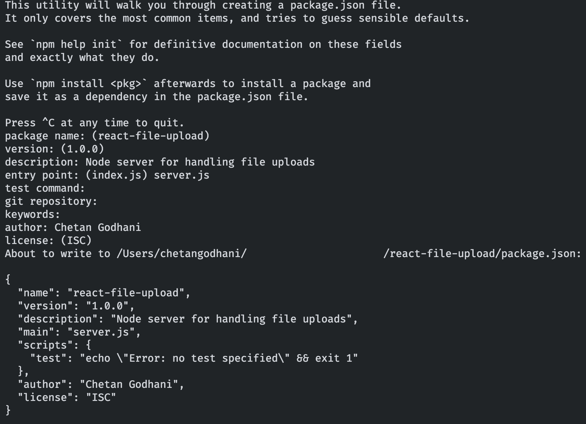

> In this Post we will learn how to upload single or multiple files in different ways.

<TOC
  slug="getting-started-with-react"
  headings={[
    { id: "prerequisites", title: "Prerequisites" },
    { id: "setting-up-node-server", title: "Setting up a Simple Node.JS Server" },
    { id: "setting-up-react", title: "Setting up a React Application" },
    { id: "upload-file", title: "Uploading File", children: [
      { id: "uploading-single-file", title: "Upload single file" },
      { id: "uploading-multiple-files", title: "Upload multiple files" },
      { id: "uploading-base64-image", title: "Upload Image in a base64 encoding" }
    ]},
    { id: "conclusion", title: "Conclusion" },
  ]}
/>

<h2 id="prerequisites">Prerequisites</h2>

Don't worry, if you don't have knowledge of React or Node.js. You will get good idea after reading this post.

- [Node.js](https://nodejs.dev/learn) and [NPM](https://www.npmjs.com/) installed globally.

<h2 id="setting-up-node-server">Setting up a Simple Node Server</h2>

In this step, we will create a simple node.js server which will handle our file upload and store it in a directory.

To create server, we will use express framework which will make our work easier. With express framework, we will use Multer package. Multer is a middleware for handling `multipart/form-data`.

```bash
# Create a directory for backend code & Run this command and follow steps in attached screenshot.
$ npm init
# Install following packages afer runninng above command
$ npm install express multer cors body-parser base64-img --save
```


<p class="mt-2">Create a file inside the directory named `server.js`. And add below code in the file. </p>

```javascript
// server.js file

// Import Express to create Node.js server
const express = require('express');
const app = express();

// Import multer to handle file uploads
const multer = require('multer');

// Import CORS middleware to allow CrossOrigin Requests to this server
const cors = require('cors');

// Create Upload Instace to use in route middlware
const upload = multer({ dest: 'uploads/' });

// Add CORS Middleware to express instance.
app.use(cors());

app.get('/', (req, res) => {
  res.send('We are live');
});

// Route Controller for uploading a single file
// Some code here...

// Route Controller for uploading multiple files
// Some code here...

// Route Controller for uploading base64 and convert to file.
// Some code here...

app.listen(3001, () => {
  console.log('Listing on port 3001');
});
```

Above code will be used to create Node.js server. To run the code, just type `node server.js` command in terminal within the same directory. This will start the server on port 3001. You can access it on `http://localhost:3001`.

<h2 id="setting-up-react">Setting up a React Application</h2>

Creating a React App requires lots of javascript configuration and mainting them. [Create-React-App](https://create-react-app.dev/) is a CLI tool which lets us generate all the things needed to run a project.
Here are the very few simple steps to generate a react app using create-react-app

```bash
$ npx create-react-app react-file-upload-fe
```
or
```bash
$ npm install -g create-react-app
$ create-react-app react-file-upload-fe
```
then
```bash
$ cd react-file-upload-fe && npm start
```
You can then open the `react-file-upload-fe` folder inside a code editor and get started with code and start making changes in `src/App.js` file.

<h2 id="upload-file">Let's start with File Upload</h2>

In this section, we will learn how to upload a single file, multiple files, and a base64 file. We will also learn how we can process the base64 file on Backend side.

We will create seperate components for all above methods of uploading file.

<h3 id="uploading-single-file" class="mt-0 font-size-20">1. Upload single file</h3>

For Backend Part, Below is the code for route controller to upload a single file.

```javascript
// Refer to the Server.js file attached in Github link for "upload" and "app" constant.
// Backend Route Controller for uploading a single file
app.post('/single', upload.single('singleImage'), (req, res) => {
  try {
    res.status(200).send({ message: 'File uploaded successfully.' });
  } catch (err) {
    res.status(400).send({ message: 'Error uploading file.' });
  }
});
```

For Frontend Part, We will create a component call `SingleUpload.jsx`. In this file we will add functional code, some logic for calling API, and some HTML code for upload Input.

In the code,
- `handleClick` method triggers the click to input field using ref whenever the div is clicked.
- `handleFiles` methods collects all the uploaded files via Input field.
- To send the file to the server, we have to sent it using `FormData`.
- `message` state is used to display the response message from the server.
- `formRef` is used to trigger the reset of form after the data is sent to the server.

```jsx
import React, { useRef, useState } from 'react';
import axios from 'axios';

const SingleUpload = ({ resetForm }) => {
  const [files, setFiles] = useState([]);
  const inputRef = useRef(null);
  const formRef = useRef(null);
  const [message, setMessage] = useState('');

  const handleClick = () => inputRef && inputRef.current && inputRef.current.click();
  const handleFiles = (e) => setFiles(e.target.files ? e.target.files : []);

  const handleSubmit = (e) => {
    e.preventDefault();
    if(files.length > 0) {
      const formData = new FormData();
      formData.append('singleImage', files[0]);
      axios.post('http://localhost:3001/single', formData)
        .then(data => setMessage(data.data.message))
        .catch((error) => setMessage('Error'));
      setFiles([]);
      formRef.current && formRef.current.reset();
      setTimeout(() => {
        setMessage('');
      }, 4000);
    }
  }

  return (
    <form ref={formRef}>
      <div className="mui--text-dark-secondary mui--text-button">{message}</div>
      <div className="upload-box" onClick={handleClick}>
        Click to Upload file (Single) <hr />
        {files[0] && files[0].name}
      </div>
      <input type="file" ref={inputRef} onChange={handleFiles} style={{ display: 'none' }} />
      <button className="mui-btn mui-btn--primary" onClick={handleSubmit}>Submit</button>
    </form>
  )
}

export default SingleUpload;
```

<h3 id="uploading-multiple-files" class="mt-0 font-size-20">2. Upload multiple files</h3>

For Backend Part, Below is the code for route controller to upload multiple files.

```javascript
// Refer to the Server.js file attached in Github link for "upload" and "app" constant.
// Backend Route Controller for uploading a single file
app.post('/single', upload.single('singleImage'), (req, res) => {
  try {
    res.status(200).send({ message: 'File uploaded successfully.' });
  } catch (err) {
    res.status(400).send({ message: 'Error uploading file.' });
  }
});
```

For Frontend Part, We will create a component call `MultipleUpload.jsx`. We will follow the same process from above.

There is one change here,
- Whenever we want to upload multiple files within same key, we have to loop through all the files and attach/append it to same key in FormData.

```jsx
import React, { useRef, useState } from 'react';
import axios from 'axios';

const MultipleUpload = () => {
  const [files, setFiles] = useState([]);
  const [message, setMessage] = useState('');
  const inputRef = useRef(null);
  const formRef = useRef(null);

  const handleClick = () => inputRef && inputRef.current && inputRef.current.click();
  const handleFiles = (e) => setFiles(e.target.files ? Array.from(e.target.files) : []);

  const handleSubmit = (e) => {
    e.preventDefault();
    if (files.length > 0) {
      const formData = new FormData();
      files.forEach(file => formData.append('multipleImages', file));
      axios.post('http://localhost:3001/multiple', formData)
        .then(data => setMessage(data.data.message))
        .catch((error) => setMessage('Error'));
      setFiles([]);
      formRef.current && formRef.current.reset();
      setTimeout(() => {
        setMessage('');
      }, 4000);
    }
  }

  return (
    <form ref={formRef}>
      <div className="mui--text-dark-secondary mui--text-button">{message}</div>
      <div className="upload-box" onClick={handleClick}>
        Click & Select files to Upload (Multiple) <hr />
        {files.map((x, index) => <React.Fragment key={index}>{x.name}<br/></React.Fragment>)}
      </div>
      <input type="file" ref={inputRef} onChange={handleFiles} style={{ display: 'none' }} multiple />
      <button type="submit" className="mui-btn mui-btn--primary" onClick={handleSubmit}>Submit</button>
    </form>
  )
}

export default MultipleUpload;
```

<h3 id="uploading-base64-image" class="mt-0 font-size-20">3. Upload Image in a base64 encoding & Save on Server Side</h3>

For Backend Part, Below is the code for route controller to upload base64 image file and how to save on server.

```javascript
// Refer to the Server.js file attached in Github link for all constants.
// Method taken from base64-img library
const img = (data) => {
  const reg = /^data:image\/([\w+]+);base64,([\s\S]+)/;
  const match = data.match(reg);
  const baseType = {
    jpeg: 'jpg'
  };

  baseType['svg+xml'] = 'svg'

  if (!match) {
    throw new Error('image base64 data error');
  }

  const extname = baseType[match[1]] ? baseType[match[1]] : match[1];

  return {
    extname: '.' + extname,
    base64: match[2]
  };
}

const imgSync = async (data, destpath, name) => {
  const result = img(data);
  const filepath = path.join(destpath, name + result.extname);

  await fs.writeFileSync(filepath, result.base64, { encoding: 'base64' });
  return filepath;
};

// Route Controller for uploading base64 image file
app.post('/base64', async (req, res) => {
  try {
    const { base64Image, fileName } = req.body;
    await imgSync(base64Image, './uploads', fileName)

    res.status(200).send({ message: 'Files uploaded successfully.' });
  } catch (err) {
    res.status(400).send({ message: 'Error uploading file.' });
  }
});
```

For Frontend Part, We will create a component call `Base64Upload.jsx`. We will follow the same process from above.

There is one change here,
- Whenever we want upload a file, it is in Byte stream, so we have to covert it to base64 string using FileReader APIs available in browser.
- Once converted to base64 string, we can send it to server using normal json.

```jsx
import React, { useState, useRef } from 'react';
import axios from 'axios';

const Base64Upload = () => {
  const [base64, setBase64] = useState(null);
  const [fileName, setFileName] = useState('');
  const [message, setMessage] = useState('');
  const inputRef = useRef(null);
  const formRef = useRef(null);

  const handleClick = () => inputRef && inputRef.current && inputRef.current.click();

  const createBase64Image = (file) => {
    const reader = new FileReader();
    return new Promise(function (resolve, reject) {
      reader.onload = function (event) {
        resolve(event.target.result)
      }
      reader.readAsDataURL(file);
    })
  }

  const handleFiles = async (e) => {
    if (e.target.files[0]) {
      const base64 = await createBase64Image(e.target.files[0]);
      console.log('base64', base64);
      setBase64(base64);
      setFileName(e.target.files[0].name);
    }
  }

  const handleSubmit = (e) => {
    e.preventDefault();
    if (base64 && base64 !== '') {
      axios.post('http://localhost:3001/base64', { base64Image: base64, fileName: Date.now() + '-' + fileName })
        .then(data => setMessage(data.data.message))
        .catch((error) => setMessage('Error'));
      setBase64(null);
      setFileName('');
      formRef.current && formRef.current.reset();
      setTimeout(() => {
        setMessage('');
      }, 4000);
    }
  }

  return (
    <form ref={formRef}>
      <div className="mui--text-dark-secondary mui--text-button">{message}</div>
      <div className="upload-box" onClick={handleClick}>
        Click to Upload file (Base64) <hr />
        {fileName}
      </div>
      <input type="file" ref={inputRef} onChange={handleFiles} style={{ display: 'none' }} accept="image/*" />
      <button type="submit" className="mui-btn mui-btn--primary" onClick={handleSubmit}>Submit</button>
    </form>
  )
}

export default Base64Upload;
```

<h2 id="conclusion">Conclusion</h2>

In this post, we’ve learned about How to Upload Files using React, we’ve also seen how to handle the file uploads in Node.js backend. The code used in this article can be found on [GitHub](https://github.com/chetan8300/react-node-file-upload).